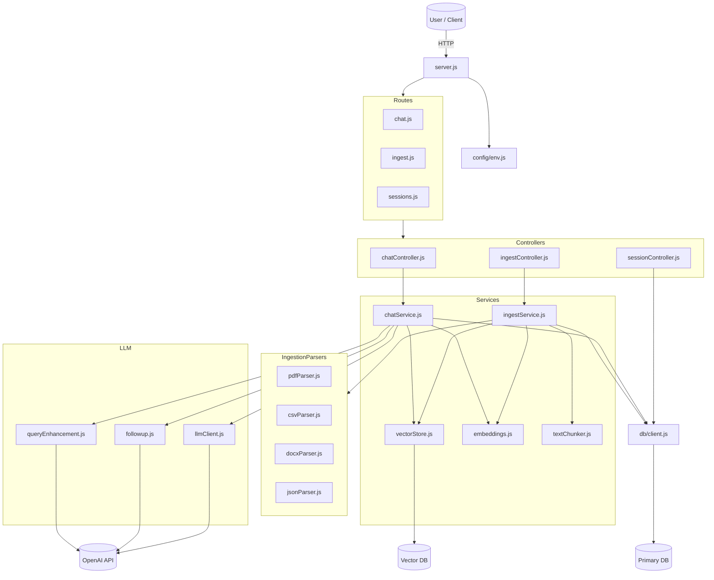

# Multi-Source-RAG-API
A Multi-Source RAG API that ingests documents from various formats, embeds them, stores vectors, and exposes retrieval-augmented chat endpoints.

## Architecture Overview
### System Design Diagram


### Component Resposibilities
| Component | Responsibility |
|----------|----------------|
| **server.js** | Initializes the application, loads configuration, registers routes, and starts the HTTP server. |
| **config/env.js** | Loads and exposes environment configuration values. |
| **db/client.js** | Provides database connectivity and exposes DB operations. |
| **routes/** | Defines API endpoints and maps them to controllers (`chat`, `ingest`, `sessions`). |
| **controllers/** | Handles incoming requests, performs validation, and delegates to services. |
| **services/chatService.js** | Handles chat workflow: embeddings, vector search, and LLM responses. |
| **services/vectorStore.js** | Stores and retrieves embeddings from the vector database. |
| **services/embeddings.js** | Generates numerical embeddings from text using an external model. |
| **services/textChunker.js** | Splits raw text into chunks suitable for embedding. |
| **services/ingestion/ingestService.js** | Coordinates the ingestion pipeline (parse → chunk → embed → index). |
| **services/ingestion/\*.js** | File format parsers for PDF, CSV, DOCX, and JSON. |
| **llm/llmClient.js** | Sends generation requests to the LLM provider and returns model-generated answers used in chat responses. |
| **llm/followup.js** | Detects whether a message is a follow-up question and helps convert it into a proper standalone query when needed. |
| **llm/queryEnhancement.js** | Rewrites the user’s message into a search-optimized query to improve retrieval quality, using recent chat history for context. |

## Technical Decisions & Trade-offs
### Database
SQLite was chosen as the database because it requires zero setup, works out-of-the-box, and is ideal for a small projects. A full database server like PostgreSQL would add unnecessary infrastructure without improving the solution for this scenario. Prisma is used as the ORM layer on top of SQLite. It provides a clean and type-safe way to work with the database and handles schema migrations automatically. Prisma was chosen because it offers the one of the fastest and most developer friendly workflow for a small project like this, without adding unnecessary complexity.

### Vector DB
Qdrant was selected as the vector database since it’s lightweight, easy to implement, and purpose-built for vector search. Managed services like pgvector in Postgres would introduce extra infrastructure complexity that isn’t needed for this project. A tradeoff with Qdrant is that it adds an extra Docker dependency compared to using pgvector inside the main database, but the improved search performance and simpler developer experience are worth it for this RAG-focused task.

### Chunking Strategy
The system uses fixed-size text chunks of 800 characters with 100 characters overlap. This size is large enough to preserve semantic meaning while keeping embeddings efficient. The 100-character overlap ensures continuity between chunks so important context isn’t lost at boundaries. This approach balances embedding cost, retrieval accuracy, and simplicity, making it a good fit for a multi-source RAG pipeline.

### Embedding Model
The project uses OpenAI’s text-embedding-3-small model for generating vector embeddings. It provides strong semantic quality at low cost, it is fast, and produces compact vectors, which is ideal for a lightweight RAG pipeline. This model has the ideal balance between accuracy, speed, and token cost for this system. In addition OpenAI provides good documentation for implementation.

### Design patterns

- **Strategy pattern:**  
  The ingestion layer uses separate parser modules (`pdfParser`, `csvParser`, `docxParser`, `jsonParser`) that implement the same responsibility. `ingestService` selects the appropriate parser based on file type, making it easy to add new formats without changing the core pipeline.

- **Repository pattern:**  
  `vectorStore` and `db/client` act as repositories that encapsulate access to the vector DB and relational DB. The rest of the code works with clear methods (e.g. add/search vectors, read/write entities) without depending on Qdrant/SQLite details.

- **Layered controller–service architecture:**  
  HTTP routes → controllers → services is a simple layering pattern that keeps transport concerns (Express, validation) separate from domain logic (chat, ingestion, sessions).


### Async processing
Ingestion jobs are handled via a simple in-memory job queue. `POST /ingest` starts an async job, stores it in `ingestJobs` with a `job_id`, and returns `202 Accepted` immediately. The actual work (parsing, chunking, embeddings, vector upserts) runs in the background, and the client polls `GET /ingest/:jobId` to track status (`queued`, `processing`, `completed`, `error`). This avoids blocking requests while keeping the implementation lightweight.

### RAG Enhancements
**Query Enhancement:**  
User messages are rewritten into clearer, standalone queries before vector search. This improves retrieval quality by removing ambiguity, simplifying phrasing, and ensuring the search query contains all necessary context.

**Follow-up Context Handling:**  
The system detects when a message is likely a follow-up question and automatically attaches it to the most recent conversation session when no session_id is provided. If session_id is provided and it is classified as follow-up it attaches the message to the specified session. It then expands the message into a standalone question using prior conversation history. This preserves context across turns and significantly improves retrieval accuracy for multi-turn interactions.

## Production Considerations
Key improvements I would implement to make the system scalable, secure, observable, and cost-efficient in a real production environment.

### Scalability
- **Database:** move from SQLite to PostgreSQL for better concurrency, indexing, and reliability.
- **Vector DB:** run Qdrant in a clustered/managed setup instead of a single local instance.
- **Ingestion jobs:** replace the in-memory `ingestJobs` map with a durable queue so jobs survive restarts and can be processed by multiple workers.
- **API instances:** make the API stateless and run multiple Node.js instances behind a load balancer.
- **File storage:** store original documents in object storage instead of the local filesystem.

### Security improvements
- **Harden auth & access control:** secure all APIs with authentication and enforce per-user / per-tenant access to documents and sessions.
- **Protect secrets:** store API keys and credentials in a secrets manager instead of `.env` files on the server.
- **Enforce HTTPS & TLS:** terminate TLS at the load balancer and ensure all traffic (external and internal) is encrypted in transit.
- **Validate & sanitize inputs:** add strict validation for request bodies, file uploads, and query params to avoid injection and abuse.
- **Lock down file handling:** restrict allowed MIME types, size limits, and scan uploads for malware before processing.
- **Add rate limiting & abuse protection:** rate limit endpoints and add basic DDoS / brute-force protection.

### Monitoring & Observability
- **Metrics:** track request rate, latency, error rates, embedding/ingestion durations, and vector search performance.
- **Logging:** use structured, centralized logging with correlation IDs per request/job.
- **Tracing:** add distributed tracing around key flows: ingestion pipeline, embedding calls, vector DB queries, and LLM calls.
- **Dashboards:** create dashboards for API latency, Qdrant performance, queue depth, and failure rates.
- **Alerts:** configure alerts on error spikes, slow responses, failed jobs, or degraded vector/LLM dependencies.

### Cost Optimizations
- **Optimize embeddings:** batch texts, cache embeddings when possible, and avoid regenerating unchanged content.
- **Use smaller models when appropriate:** choose cost-efficient embedding/LLM models for routine queries and reserve larger models for higher-value tasks.
- **Reduce unnecessary storage:** clean old ingestion artifacts, prune unused vectors, and compress logs.
- **Autoscale workloads:** scale ingestion workers and API instances based on demand instead of running at peak capacity 24/7.
- **Implement rate limits & quotas:** prevent abuse and limit expensive operations per user or tenant.

## Running the Project with Docker

This project ships with a Docker setup that runs both the Node.js API and the Qdrant vector database.

### Prerequisites
- Docker installed
- Docker Compose installed
- OpenAI API key

---
### 1. Clone the repository

```bash
git clone https://github.com/FredrikPD/Multi-Source-RAG-API.git
cd Multi-Source-RAG-API
```
### 2. Configure environment variables

Copy the example env file:

```bash
cp .env.example .env
```
Insert your API KEY in .env file:
```
OPENAI_API_KEY=your-openai-key
```

### 3. Start the full stack
```
docker compose up --build
```

### 4. Stopping and cleaning up
Stop containers:
```
docker compose down
```
Stop + remove volumes (clears Qdrant data):
```
docker compose down -v
```

## API Documentation

Base URL defaults to `http://localhost:3000`. All JSON requests require `Content-Type: application/json` unless otherwise noted. The API communicates with Qdrant at `http://qdrant:6333` inside the Docker network.

### POST /ingest
- Accepts `multipart/form-data` with a single file field named `file`.
- Supported files: PDF, DOCX, CSV, JSON, TXT (MIME or extension based).
- Responses:
  - `202 Accepted` `{ "job_id": "<uuid>", "status": "queued" }`
  - `curl: (26) Failed to open/read local data from file/application`
- Errors during processing are surfaced when polling status (see below), not in this response.

```bash
curl -X POST http://localhost:3000/ingest -F "file=@/path/to/file"
```

### GET /ingest/status/:jobId
- Poll the ingestion job status.
- Responses:
  - `200 OK` (in progress) `{ "job_id": "<uuid>", "status": "queued" | "processing" }`
  - `200 OK` (completed) `{ "job_id": "<uuid>", "status": "completed", "document_id": "<uuid>", "chunks": <number> }`
  - `400 Bad Request` (unsupported file) `{ "job_id": "<uuid>", "status": "error", "error": "<message>", "code": "UNSUPPORTED_FILE_TYPE" }`
  - `500 Internal Server Error` (other ingest failures) `{ "job_id": "<uuid>", "status": "error", "error": "<message>", "code": "<optional>" }`
  - `404 Not Found` `{ "error": "Job not found" }`

```bash
curl http://localhost:3000/ingest/status/<jobID>
```

### POST /chat
- Send a chat message to the RAG pipeline. Creates a session automatically if `session_id` is omitted and question is not classified as follow-up.
- Request body: `{ "message": "<user question>", "session_id"?: "<uuid>" }`
- Responses:
  - `200 OK`:
    ```json
    {
      "session_id": "<uuid>",
      "answer": "<assistant reply>",
      "sources": [
        { "document_id": "<uuid>", "chunk_id": "<chunk id>", "score":"<similarity>"}
      ]
    }
    ```
  - `400 Bad Request` for missing/empty `message` or non-string `session_id`.
- Notes: history-aware; follow-up questions are rewritten for better retrieval; messages are persisted for the session.

Chat for current session:
```bash
curl -X POST http://localhost:3000/chat -H "Content-Type: application/json" -d '{"message": ""}'
```
Chat for previous session: 
```bash
curl -X POST http://localhost:3000/chat -H "Content-Type: application/json" -d '{"session_id": "", "message": ""}'
```

### GET /sessions/:id
- Retrieve the full chat history for a session.
- Responses:
  - `200 OK`:
    ```json
    {
      "session_id": "<uuid>",
      "messages": [
        { "role": "user", "content": "<text>", "sources": null },
        { "role": "assistant", "content": "<text>", "sources": [ { "document_id": "...", "chunk_id": "...", "score": "<number>" } ] }
      ]
    }
    ```
  - `400 Bad Request` `{ "error": "Missing or invalid session id" }`
  - `404 Not Found` `{ "error": "Session not found" }`

```bash
curl http://localhost:3000/sessions/<sessionID>
```

## Testing

The project includes a suite of integration and unit tests built with **Vitest** and **Supertest**. The tests focus on verifying core system behavior, controller logic, async ingestion flow, vector search integration, and chat orchestration.

### Integration Tests
- **Ingestion API** (`ingestAPI.test.js`)  
  Validates `/ingest` and `/ingest/status/:jobId`, including job queuing, async processing, error propagation, and missing file handling.

- **Sessions API** (`sessionsAPI.test.js`)  
  Ensures session retrieval logic works correctly, including Prisma mocks, non-existent sessions, and message shaping.

- **Chat API** (`chatAPI.test.js`)  
  Confirms `/chat` correctly validates input and returns the service-level response, with the chat service fully mocked.

### Unit Tests
- **Follow-up Detection** (`followup.test.js`)  
  Tests NLP heuristics for identifying follow-up questions using a variety of phrasing and edge cases.

- **Chat Orchestration** (`chatService.test.js`)  
  A test covering the full chat pipeline: session creation, query rewriting, embedding generation, vector search, LLM call, and message persistence.

- **Vector Store** (`vectorStore.test.js`)  
  Mocks Qdrant and verifies that search results are normalized into the simplified format used by the application.

### Running Tests

Before running the test suite, install dependencies:
```bash
npm install
```
Full suite:
```bash
npm run test
```
Separate:
```bash
npm run test:unit
npm run test:integration
```

## Evaluation

Retrieval quality was evaluated using 18 custom questions created from the sample documents in `eval/documents`. Each question was run through the actual system so that embeddings, vector search, and chunk retrieval behaved exactly as they do in real usage. For every question, the returned chunks were manually inspected, and the chunks that best answered the question were selected as the ground truth. These chunk IDs were then paired with the corresponding cases in `eval/cases.js`, forming a labeled set used to compute precision, recall, F1, and accuracy.

**Reproducibility note:** the exact results cannot be reproduced now because the SQLite database was cleaned during development, which caused chunk IDs to change. The evaluation logic remains valid, but the specific ground-truth chunk IDs represent the database state at the time of evaluation.

### Results (from `eval/results/evaluation.json`)
- **Macro Precision:** 0.3333  
- **Macro Recall:** 0.8056  
- **Macro F1:** 0.4611  
- **Accuracy (on cases with a known answer):** 0.8824  

The system demonstrates **high recall**, meaning it usually retrieves the correct passages. However, precision is lower because it often includes additional, irrelevant context. Improving source filtering or top-k selection would likely increase the overall F1 score.