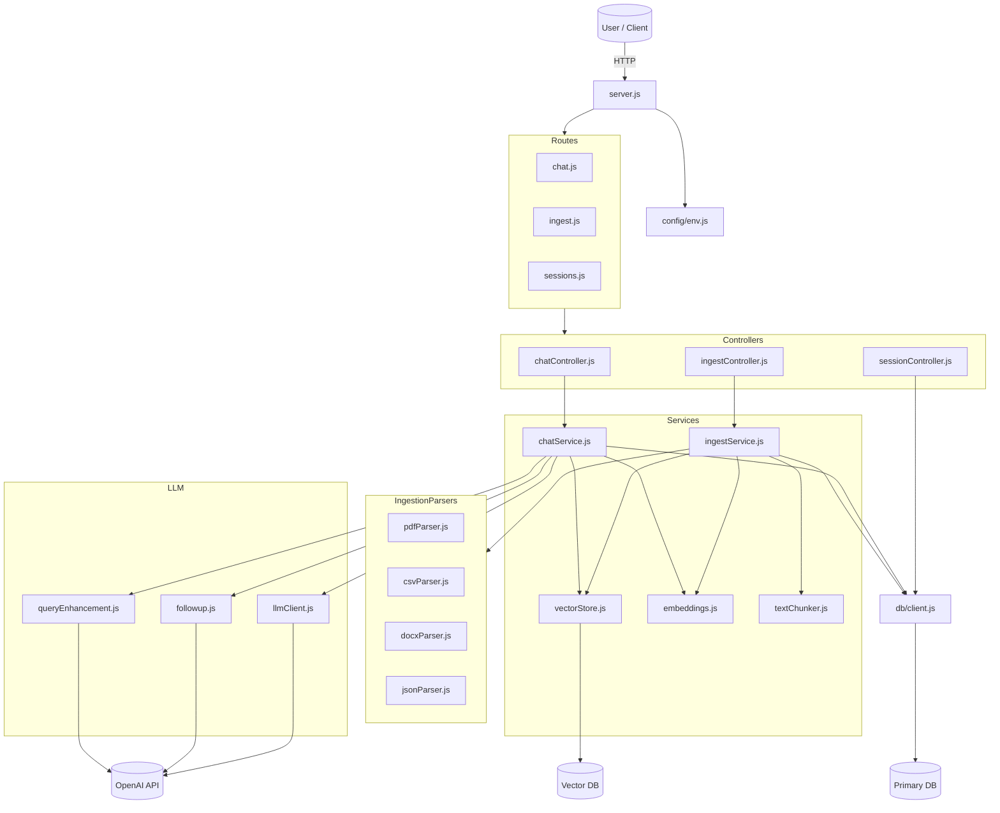

# Multi-Source-RAG-API
A Multi-Source RAG API that ingests documents from various formats, embeds them, stores vectors, and exposes retrieval-augmented chat endpoints.

## Architecture



### Components
| Component | Responsibility |
|----------|----------------|
| **server.js** | Initializes the application, loads configuration, registers routes, and starts the HTTP server. |
| **config/env.js** | Loads and exposes environment configuration values. |
| **db/client.js** | Provides database connectivity and exposes DB operations. |
| **routes/** | Defines API endpoints and maps them to controllers (`chat`, `ingest`, `sessions`). |
| **controllers/** | Handles incoming requests, performs validation, and delegates to services. |
| **services/chatService.js** | Handles chat workflow: embeddings, vector search, and LLM responses. |
| **services/vectorStore.js** | Stores and retrieves embeddings from the vector database. |
| **services/embeddings.js** | Generates numerical embeddings from text using an external model. |
| **services/textChunker.js** | Splits raw text into chunks suitable for embedding. |
| **services/ingestion/ingestService.js** | Coordinates the ingestion pipeline (parse → chunk → embed → index). |
| **services/ingestion/\*.js** | File format parsers for PDF, CSV, DOCX, and JSON. |
| **llm/llmClient.js** | Sends generation requests to the LLM provider and returns model-generated answers. |
| **llm/followup.js** | Detects follow-up questions and converts them into standalone queries. |
| **llm/queryEnhancement.js** | Rewrites user messages into search-optimized queries to improve retrieval quality. |

## Getting Started

### Prerequisites
- Docker
- Docker Compose
- OpenAI API key

### Setup

```bash
git clone https://github.com/FredrikPD/Multi-Source-RAG-API.git
cd Multi-Source-RAG-API
cp .env.example .env
```

Add your API key to `.env`:
```
OPENAI_API_KEY=your-openai-key
```

### Start

```bash
docker compose up --build
```

### Stop

```bash
docker compose down          # stop containers
docker compose down -v       # stop + remove volumes (clears Qdrant data)
```

## API

Base URL: `http://localhost:3000`
All JSON requests require `Content-Type: application/json`.

### POST /ingest
Accepts `multipart/form-data` with a `file` field. Supported formats: PDF, DOCX, CSV, JSON, TXT.

Returns `202 Accepted` immediately with a job ID. Processing runs asynchronously.

```bash
curl -X POST http://localhost:3000/ingest -F "file=@/path/to/file"
# { "job_id": "<uuid>", "status": "queued" }
```

### GET /ingest/status/:jobId
Poll ingestion status.

```bash
curl http://localhost:3000/ingest/status/<jobId>
# { "job_id": "<uuid>", "status": "completed", "document_id": "<uuid>", "chunks": <number> }
```

Possible statuses: `queued`, `processing`, `completed`, `error`.

### POST /chat
Send a message to the RAG pipeline. Automatically creates a session if `session_id` is omitted and the message is not a follow-up.

```bash
curl -X POST http://localhost:3000/chat \
  -H "Content-Type: application/json" \
  -d '{"message": "What is in the document?"}'

curl -X POST http://localhost:3000/chat \
  -H "Content-Type: application/json" \
  -d '{"session_id": "<uuid>", "message": "Tell me more"}'
```

Response:
```json
{
  "session_id": "<uuid>",
  "answer": "<assistant reply>",
  "sources": [
    { "document_id": "<uuid>", "chunk_id": "<chunk id>", "score": "<similarity>" }
  ]
}
```

### GET /sessions/:id
Retrieve full chat history for a session.

```bash
curl http://localhost:3000/sessions/<sessionId>
```

## Testing

```bash
npm install
npm run test            # full suite
npm run test:unit       # unit tests only
npm run test:integration  # integration tests only
```

Tests are built with **Vitest** and **Supertest**, covering ingestion flow, chat orchestration, session retrieval, vector search, and follow-up detection.
